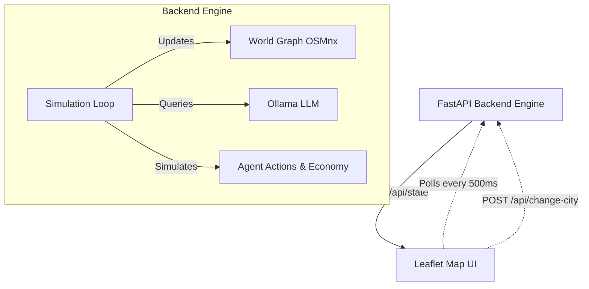
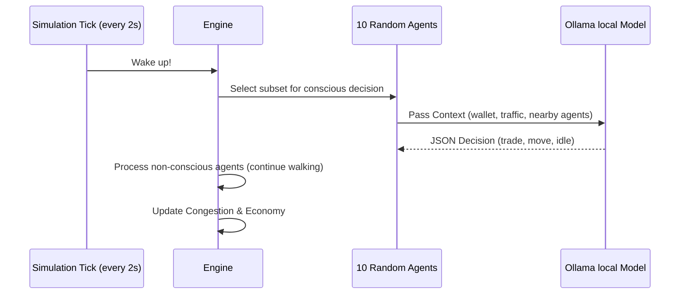

# Emergent City 🏙️

Welcome to **Emergent City**, an open-source, AI-driven city simulation. Watch autonomous agents (powered by Ollama local LLMs) live, move, and trade across authentic city street maps dynamically downloaded from OpenStreetMap.

This robust prototype was fully built using **FastAPI** for the backend engine and **Leaflet.js** for an ultra-smooth, continuous frontend visualization.

---

## 🧠 Why This Was Built

**Emergent City** was built as an experimental project to explore **emergence in multi-agent systems**. 
The goal was to answer the question: 
> *If you give a few dozen AI agents basic rules about a city block, a small amount of money, and awareness of traffic, what kind of macro-economic and geographical patterns naturally emerge without any explicit hard-coded instruction?*

By utilizing local, small-parameter models (like `qwen2.5:3b`), the project proves that you can run highly complex, conscious simulated environments entirely locally, without relying on expensive, rate-limited external APIs. The decoupled architecture ensures that even when the AI models "think" slowly, the frontend visualization runs at a buttery smooth 60 FPS.

---

## 📐 Architecture

The application is split into a **Python Backend (FastAPI)** and a **JavaScript Frontend (Leaflet.js)**. They communicate via simple HTTP polling.

### High-Level Flow


### Agent Decision Loop
Because invoking an LLM for 100 agents simultaneously is too heavy for a typical local machine, the engine uses a **Round-Robin Execution Model**:


---

## 🚀 How to Fork & Build

To install and run this application yourself, you will need exactly two things installed on your machine: **Python 3** and **Ollama**.

### 1. Run Ollama Locally
Make sure you have [Ollama installed](https://ollama.com/) and running in the background. Pull the default model:
```bash
ollama run qwen2.5:3b
```

### 2. Setup the Python Environment
Clone your fork of this repository, then set up the backend dependencies:
```bash
# Optional: Create a virtual environment
python3 -m venv venv
source venv/bin/activate

# Install requirements
pip install -r requirements.txt
```

### 3. Start the Server
Run the FastAPI application via `uvicorn`:
```bash
uvicorn main:app --reload
```

### 4. Open the City!
Open your browser and navigate to:
**[http://localhost:8000](http://localhost:8000)**

---

## 💡 Ideas for Expansion (Fork It!)

This codebase is specifically designed to be highly modular. Here are a few ideas of what you could build by forking this project:

1. **New Agent Personas**: Add `police` to decrease local crime scores, or `delivery_drivers` that must pick up packages from `shops` and deliver them to `residents`.
2. **Dynamic Weather**: Inject a weather API into the backend. Pass "It is raining" to the LLM prompt and watch as agents autonomously decide to seek shelter or stay home!
3. **Public Transit**: Implement bus routes. If bus agents follow a strict path, will the LLM residents naturally learn to wait at nodes along that path if they realize it's cheaper/faster?
4. **Multiplayer Observer Mode**: Since the frontend just polls `api/state`, you could host the backend on a server and let multiple people watch the same evolving city simultaneously!
5. **Real-time LLM Streaming Stats**: Track and graph the average tokens/second during the simulation to benchmark various local models against each other.

---
*Built with ❤️ and Local AI Models.*
